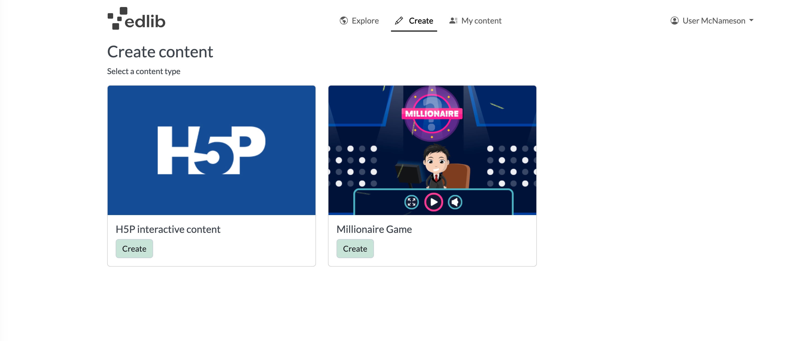
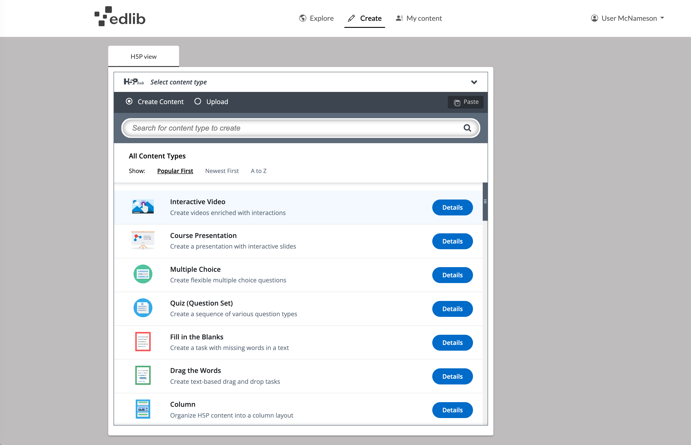

# Creating content

This article will look at how to create new content in Edlib.

Click the **Create content** button on the top left of the page to start creating content. If you only have one LTI-tool such as Content Author for H5P interactive content, you will be sent directly to this editing tool. If there are more LTI-tools configured on your Edlib, you'll be presented with a page displaying these entries from which you enter to create the type of content you want. 

<i> Example from Gamilab.com where the user can choose between creating various H5P content, or a adding questions to a mini game.</i>

## H5P interactive content

The H5P interactivities will probably be your most-used category. Here you will find most of the supported [H5P's](https://docs.edlib.com/docs/product/features#h5p) in Edlib's catalog. 
You can approach creating your own interactive content in three ways:

<!-- no toc -->
- [Create a H5P from scratch](#create-from-scratch)
- [Upload an H5P](#upload-an-h5p)
- [Paste an Edlib resource](#paste-another-edlib-resource)

### Create from scratch

The default choice is to create your resource from scratch. Start by choosing which H5P type you want to use. You can use the search bar to search for a specific resource from the list below. Clicking **Details** let you see a more detailed description of the H5P type, including pictures and a link to an example of the H5P type.
For more info on editing an H5P, see [Editing an Edlib Resource](./editing-resource).

<i>Create your own interactive content.</i>

:::info

For a complete list of all H5P types and how to use them, check out H5P.org's [Examples and Downloads page](https://h5p.org/content-types-and-applications).
Edlib supports most of the H5P content types.

:::

### Upload an H5P

If you've downloaded an H5P from another site that supports H5P, you can upload it here.

### Paste another H5P resource 

You can copy and paste another H5P resource to use it as a base for your new resource. This approach is useful when you've created a template that you want to use with different content

Open the resource you want to copy, and choose **Copy** on the top of the editor.

<i> Copy the resource you want to use… </i>
 

Click **Create content**, then **Interactivity**. Here you can paste the copied resource to start editing your new resource.

<i>And paste it in to create a new resource!</i>

## Question set (used by Millionaire Game)

Question sets are good tools for creating quizzes. If you want to put some extra flair to your quiz, you can create mini-games where the quizzes are run, making them extra fun and interesting. Gamilab.com has put together their own Millionaire mini game for creation of 15 question quizzes:

 

