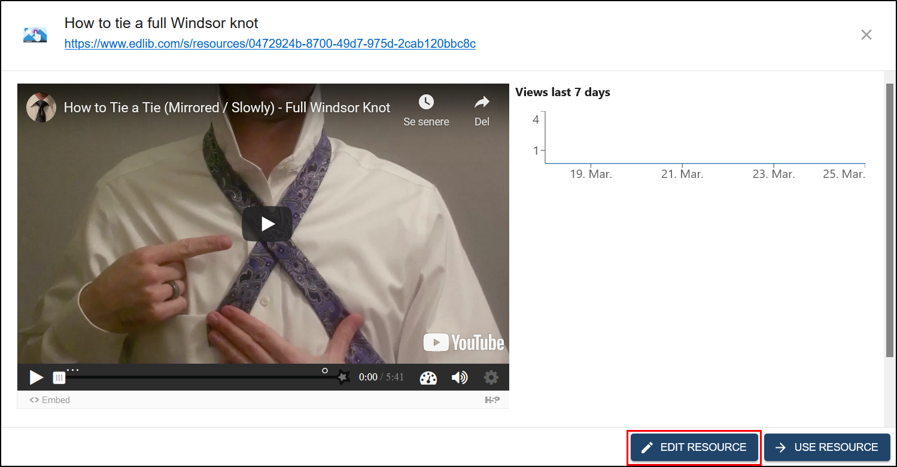
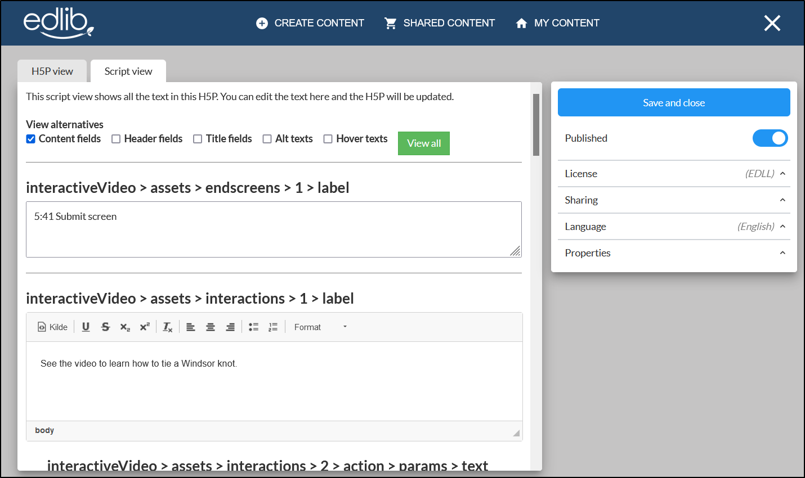
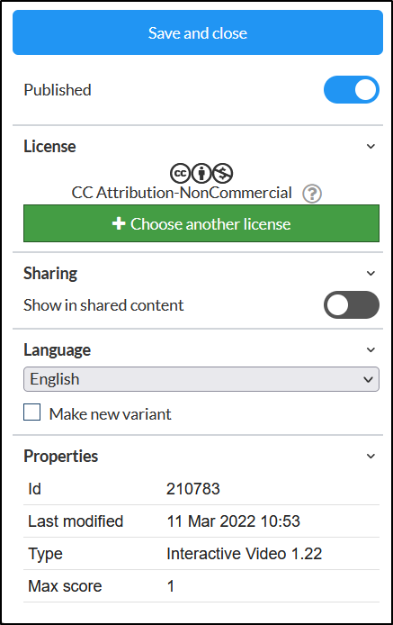
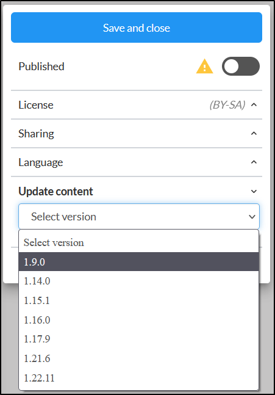

# Editing Edlib resources

This article will look at editing an already created resource on Edlib.  

:::note

This article will assume that you have already created a resource. See our article on [creating content](./create-content) if you haven't created a resource yet.

:::

## How to open content for editing

You can edit all the resources found in [My content](./my-content) by clicking on the resource you want to edit and clicking **Edit resource**. In order to edit [shared content within the Explore tab](./shared-content) you'll need to copy it first in order to have permissions to edit it.  

<i>The Edit button can be found on the content cards and in the preview window</i>

## Content Author - the LTI tool supporting the H5P editor

### H5P view

The H5P view lets you edit the resource itself. This view is identical to the standard H5P view. For more on editing an H5P, see [H5P.org - The Basics](https://h5p.org/documentation/for-authors/the-basics).

### Script view

The script view lists all the text added to the H5P. This lets you easily edit all the text added to the H5P in one view, making for an effective way to edit the text. Fields using rich text will also have a simple editor bar.  

<i>The script view makes for easy text editing</i>
  

### Properties sidebar

To the right of the editor, you will find the sidebar containing the resource's properties. Here, you can view or edit the properties of the resource.  

<!-- no toc -->
- [Publish status](#publish-status)
- [Sharing status](#sharing-status)
- [Language](#language)
- [Update content](#update-content)
- [General properties](#general-properties)

<i>The properties sidebar, showing the different settings you can change</i>

#### Publish status

Turning on this switch makes the resource available for use. Any links to the resource will not work, until it is set as published. You can at any time change the publishing status of the resource

#### Sharing status

Turning on this switch makes your resource available in the **Explore** tab for other Edlib users to use and copy. 

#### Language

Here you can set the language for the resource. In order to make translations of content, simply copy them and translate the copies you make. Note: If you are working with H5P content, make sure the langauge within the "Text overrides and translations" are set according to the contents language to ensure that all parts of the H5P displays the correct language.

#### Update content

If the H5P type of your resource has been updated after you made it, you might see the **Update content** field

From here you can select which version you want to update to. You're able to revert the change if you find that something broke during the update. Saving after updating makes the change permanent.

#### General properties

General information about your resource containing a version ID, date and timestamp, technical type and version for the content and information about potential score to be forwarded to frontend systems. 