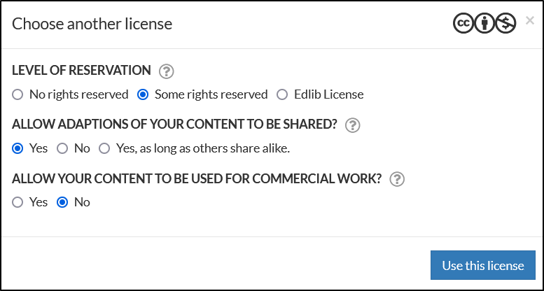

# Editing Edlib resources

This article will look at editing an already created resource on Edlib.  

:::note

This article will assume that you have already created a resource. See our article on [creating content](./create-content) if you haven't created the resource yet.

:::

## How to open the editor

You can edit all the resources found in [My content](./my-content) or [Shared content](./shared-content) by clicking on the resource you want to edit and clicking **Edit resource**.  

<i>Where to find the Edit button in the preview window</i>

## H5P view

The H5P view lets you edit the resource itself. This view is identical to the standard H5P view. For more on editing an H5P, see [H5P.org - The Basics](https://h5p.org/documentation/for-authors/the-basics).

## Script view

The script view lists all the text added to the H5P. This lets you easily edit all the text added to the H5P in one view, making for an effective way to edit the text. Fields using rich text will also have a simple editor bar.  

<i>The script view makes for easy text editing</i>
  

## Properties sidebar

To the right of the editor, you will find the sidebar containing the resource's properties. Here, you can view or edit the properties of the resource.  

<!-- no toc -->
- [Publish status](#publish-status)
- [Licence](#license)
- [Sharing status](#sharing-status)
- [Language](#language)
- [Update content](#update-content)
- [General properties](#general-properties)

<i>The properties sidebar, showing the different settings you can change</i>

### Publish status

Turning on this switch makes the resource available for use. Any links to the resource will not work, until it is set as published. You can at any time change the publishing status of the resource

### License

Here you can choose the appropriate [Creative Commons license](https://creativecommons.org/about/cclicenses). Clicking the **Choose another license** button opens a window where you can choose what you want to, or don't want to, allow.

### Sharing status

Turning on this switch makes your resource available in the **Shared content** tab for other Edlib users to use. You may also restrict its use depending on which license you choose.

### Language

Here you can set the language for the resource. You can also choose another language and check the **Make a new variant** box. This will make a copy of the resource when you save it, making translation easier.

### Update content

If the H5P type of your resource has been updated after you made it, you might see the **Update content** field

From here you can select which version you want to update to. You're able to revert the change if you find that something broke during the update. Saving after updating makes the change permanent.

### General properties

General information about your resource.