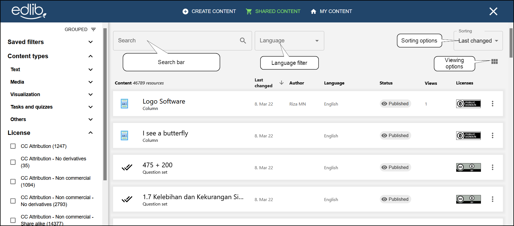
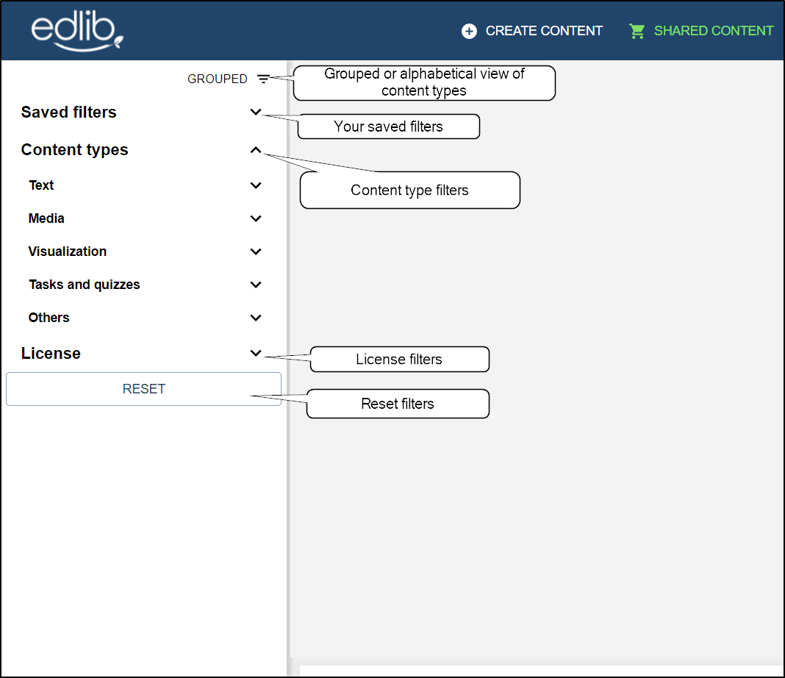
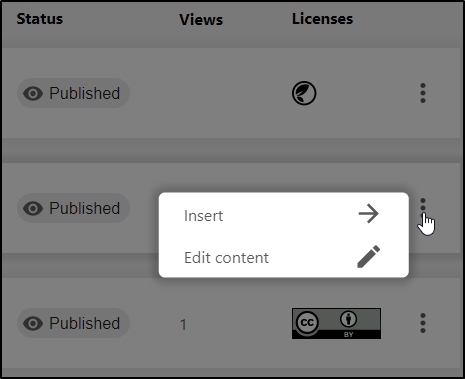

# Explore

This article will look at how to search for and use shared content within the Explore tab on Edlib.

Creating good educational resources is often a complex and time-consuming process. Most teachers are used to the concept of borrowing resources from other teachers. This concept of borrowing and sharing educational resources is central to Edlib's operating goals.  
The **Explore** tab lists all the resources other users have chosen to share with all other Edlib users. These resources can be freely used as they are or copied and adapted and stored among your own content.

:::info

Some resources might not be editable depending on their [Creative Commons lisence](https://creativecommons.org/about/cclicenses).

:::

## Searching for shared content

Click the **Explore** button on the top of the page to view all the shared Edlib resources.
 
From here, you're able to:

<!-- no toc -->
- [Search for content using the search bar](#searching)
- [Filter out content using the filter tabs](#filtering)
- [Use, edit or copy shared content](#using-shared-content)

### Searching

The search bar on top of the page lets you search through the titles of all the resources in Edlib. The search will also give results on the contents owners listed on the content cards, as well as content types and language codes also displayed on the cards. You can use quotes for term specific searches and also combine such specific searches with a pluss sign between them, e.g.  "vocabulary" + "game". Finally, you can change the result view between card and list view.

<i>Searching for resources in Edlib</i>

### Filtering

You can find the filtering option to the right of the search bar (see image below). In addition to filtering by language, you're also able to filter your search by content type. **Content type** lists all the different [H5P](https://docs.edlib.com/docs/product/features#h5p) types and other technological content types you may have installed to Edlib. You can also list the content sorted by dates for edited, created, and views. To invert the results, simply use the pagination at the bottom. 
Finally you can reset your filters by hitting the **Clear filter** button at just below the sorting filter.

### Using shared content from the Explore tab

When you've found the resource you want to use, click on it to get a preview of the resource. Afterward, you can either copy and edit it first or use it as is. The copy will be saved in the **[My content](./my-content)** tab.

<i>You can use a resource without previewing it by clicking on the </i><b>⁝</b><i> button</i>

:::note

**Will my content show up as shared content?**  
When creating and editing your own content, you will have the option of sharing that content with other users. See [Editing Edlib resources](./editing-resource) for how to set whether to share a resource or not.

:::