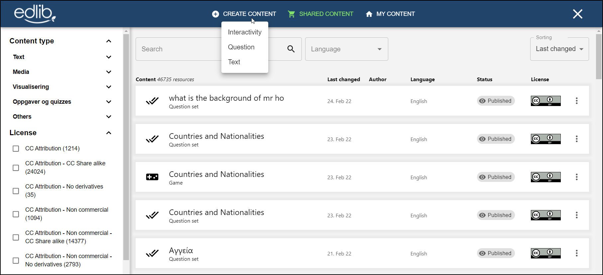
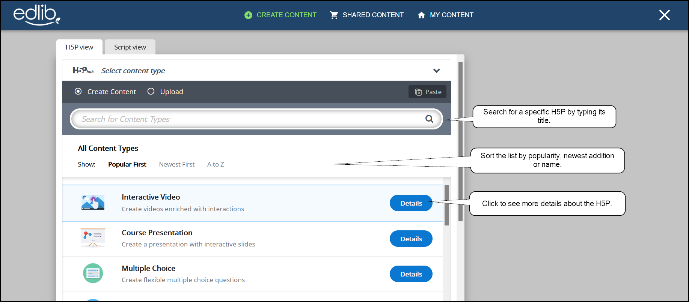
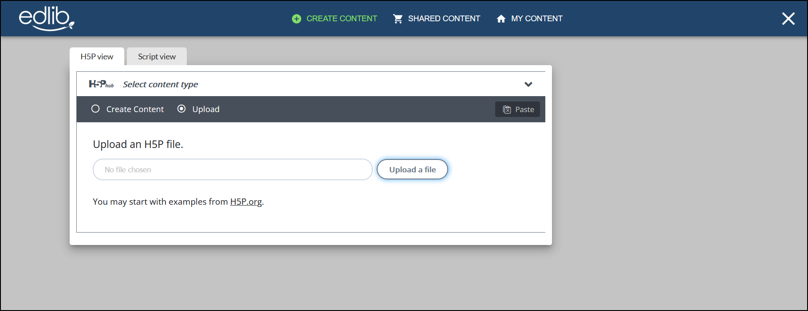
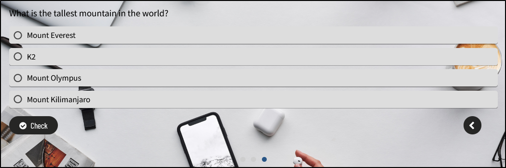
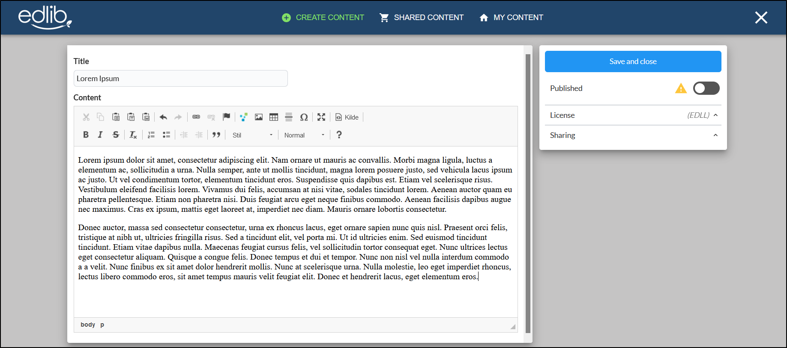

# Creating content

This guide will look at how to create new content in Edlib.

Click the **Create content** button on the top left of the page to start creating content. Here you will have three options:

<!-- no toc -->
- [Interactivity](#interactivity)
- [Question](#question)
- [Text](#text)

Starting from scratch: When you want to create your own content

## Interactivity

Interactivity will probably be your most-used category. Here you will find all the supported [H5P's](https://docs.edlib.com/docs/product/features#h5p) in Edlib's catalog. 
You can approach creating your own interactive content in three ways:

<!-- no toc -->
- [Create a H5P from scratch](#create-from-scratch)
- [Upload a H5P](#upload-a-h5p)
- [Paste an Edlib resource](#paste-another-edlib-resource)

### Create from scratch

The default choice is to create your resource from scratch. Start by choosing which H5P type you want to use. You can use the search bar to search for a specific resource or  from the list below. Clicking **Details** lets you see a more detailed description of the H5P type, including pictures and a link to an example of the H5P type.
For more info on editing an H5P, see [Editing an Edlib Resource](editing-resource.mdx).

:::info

For a complete list of all H5P types and how to use them, check out H5P.org's [Examples and Downloads page](https://h5p.org/content-types-and-applications).
Edlib supports most of the H5P content types.

:::

Create your own interactive content.

### Upload an H5P

If you've downloaded an H5P from another site (like H5P.org), you can upload it here.

### Paste another Edlib resource 

You can copy and paste another Edlib resource to use it as a base for your new resource. This approach is useful when you've created a template that you want to use with different content

Open the resource you want to copy, and choose **Copy** on the top of the editor.

Copy the resource you want to use… 

 

Click **Create content**, then **Interactivity**. Here you can paste the copied resource to start editing your new resource.

And paste it in to create a new resource!

## Question

Question sets are a good tool to create quizzes. If you want to put some extra flair to your quiz, why not make into a Millionare game show?

  

Create your quiz or Millionaire game in a few simple steps!

  

*Your question set can either become a regular quiz…*

 

*or an exciting Millionaire game!*

 

## Text

If you want your Edlib content to show a text or a simple article, you can add it here. 

