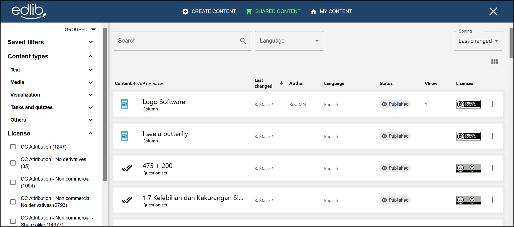

# Shared content

This article will look at how to search for and use shared content on Edlib.

Creating good educational resources is often a complex and time-consuming process. Most teachers are used to the concept of borrowing resources from other teachers. This concept of borrowing and sharing educational resources is central to Edlib's operating goals. 

## Searching for shared content

Click the **Shared content** button on the top of the page to view all the shared Edlib resources.
 
From here, youre able to:

<!-- no toc -->
- Search for content using the search bar
- Filter out content using the filter tabs
- Use, copy or edit shared content

:::info

Some resources might not be editable depending on their [Creative Commons lisence](https://creativecommons.org/about/cclicenses).

:::

<i></i>

:::note

**Will my content show up as shared content?**  
When creating and editing your own content, you will have the option of sharing that content with other users. See [Editing Edlib resources](editing-resource.mdx) for how to set whether to share a resource or not.

:::