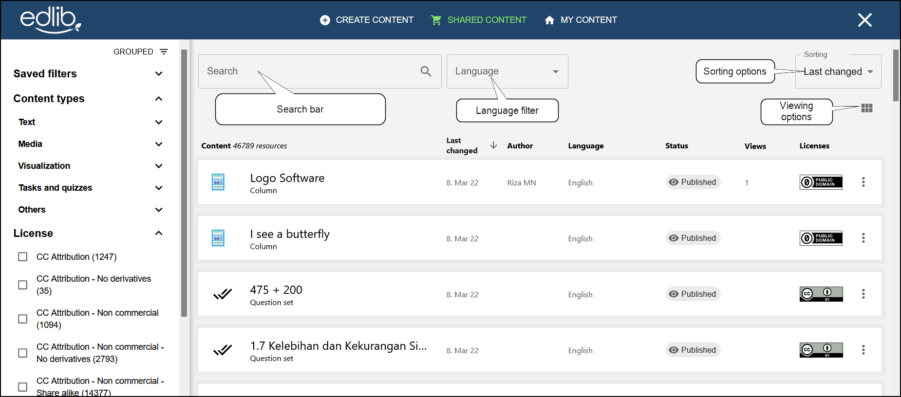

# Shared content

This article will look at how to search for and use shared content on Edlib.

Creating good educational resources is often a complex and time-consuming process. Most teachers are used to the concept of borrowing resources from other teachers. This concept of borrowing and sharing educational resources is central to Edlib's operating goals.  
The **Shared content** tab lists all the resources other users have chosen to share with all other Edlib users. These resources can be freely used and adapted to your own content.

:::info

Some resources might not be editable depending on their [Creative Commons lisence](https://creativecommons.org/about/cclicenses).

:::

## Searching for shared content

Click the **Shared content** button on the top of the page to view all the shared Edlib resources.
 
From here, you're able to:

<!-- no toc -->
- [Search for content using the search bar](#searching)
- [Filter out content using the filter tabs](#filtering)
- [Use, edit or copy shared content](#using-shared-content)

### Searching

The search bar on top of the page lets you search through the titles of all the resources in Edlib. You can also filter by language and sort the results by different parameters (relevancy, most/least used, and last/first changed). Finally, you can change the result view between list view and card view.

<i>Searching for resources in Edlib</i>

### Filtering

You can find the filter list on the left-hand side of the page (see image below). In addition to filtering by language, you're also able to filter your search by content type and license. **Content type** lists all the different [H5P](https://docs.edlib.com/docs/product/features#h5p) types, grouped by category. You can also list them alphabetically by clicking the sorting button above the filter list. **License** lets you filter your search by the  [Creative Commons lisences](https://creativecommons.org/about/cclicenses) used by the resource.  

:::tip

Want to save a combination of filters for later? Open **Saved filters** at the top of the filter list and click **Save**. That way, you can easily apply the same filter later.

:::

### Using shared content

When you've found the resource you want to use, click on it to get a preview of the resource. Afterward, you can either edit it first or use it as is. If you choose to edit the resource first, a copy will be saved in the **[My content](my-content.mdx)** tab.

<i>You can use a resource without previewing it by clicking on the </i><b>⁝</b><i> button</i>

:::note

**Will my content show up as shared content?**  
When creating and editing your own content, you will have the option of sharing that content with other users. See [Editing Edlib resources](editing-resource.mdx) for how to set whether to share a resource or not.

:::