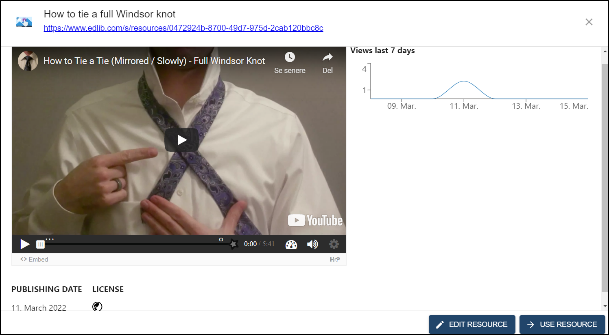

# My content

This article will look at using the **My content** tab.  
Every Edlib resource you create or edit (including [shared content](./shared-content)) will be listed in the **My content** tab. Here you will easily be able to use or edit already saved resources.

:::tip

For a thorough explanation of how to search for Edlib resources, see [Shared content](./shared-content)

:::

## Using or editing your content

When you've found the resource you want to use, click on it to get a preview of the resource. You can test the resource in full before using it from the preview. You can also see information about your resource, like when it was published, its license, and how many views it has had in the last 7 days.  

<i>Previewing your resource lets you try it out before using it.</i>
 

When you've finished previewing your resource, you can either use it as it is or [edit it first](./editing-resource).